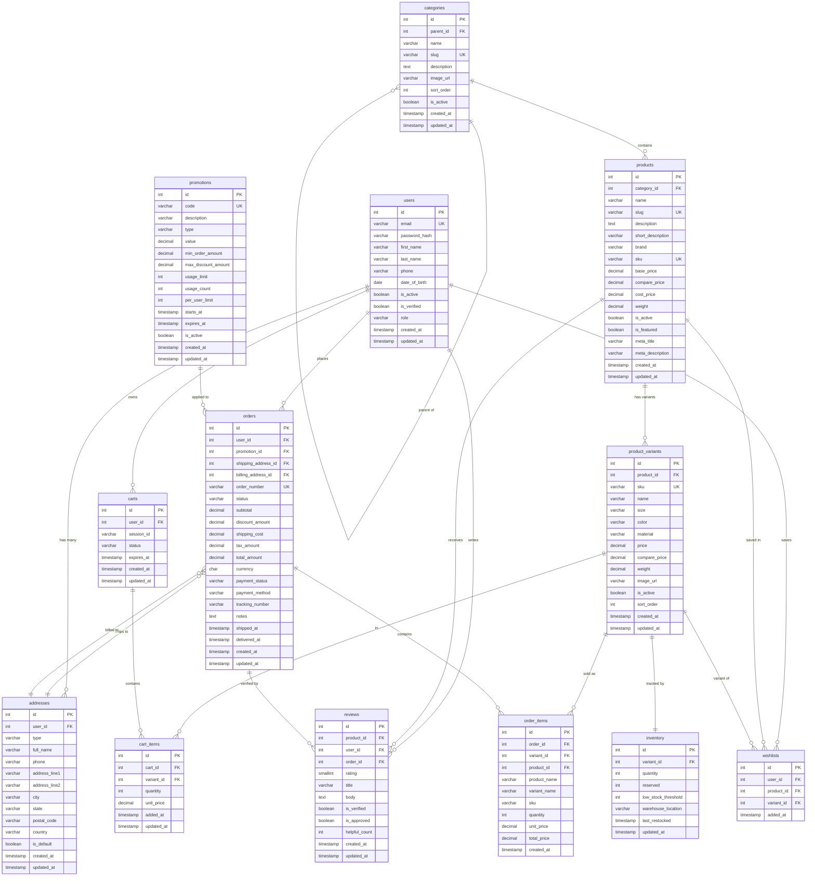

# ShopFlow E-Commerce Platform — ERD
**Author:** Thilan Buddhika | **Date:** 2026-04-28

> Generate the visual PNG by pasting the Mermaid block below into https://mermaid.live and exporting.

---

## Table Descriptions

| Table | Purpose | Key Relationships |
|---|---|---|
| `users` | Customer & admin accounts | Root entity — links to orders, reviews, carts |
| `addresses` | Shipping & billing addresses | Belongs to user; referenced by orders |
| `categories` | Hierarchical product taxonomy | Self-references for parent/child; 1 product → 1 category |
| `products` | Master product catalog | Core entity — links to variants, reviews, wishlists |
| `product_variants` | Size/color/material variations | Each variant has exactly 1 inventory row |
| `inventory` | Real-time stock levels per variant | `quantity - reserved = available` |
| `carts` | Shopping sessions (logged-in or guest) | Supports session-based guest carts |
| `cart_items` | Products in a cart | Unique per (cart, variant) |
| `promotions` | Discount codes and rules | Applied to orders at checkout |
| `orders` | Placed customer orders | Links user, addresses, promo |
| `order_items` | Denormalized line items | Stores product/variant snapshot at order time |
| `reviews` | Product ratings and text reviews | One review per user per product (UNIQUE constraint) |
| `wishlists` | Saved products for later | One entry per user per product |

## Design Decisions

- **`order_items` stores denormalized names/SKU** — preserves historical accuracy if product is later edited or deleted
- **`categories` self-references** — supports unlimited hierarchy depth via recursive CTE queries
- **`inventory.reserved`** — tracks items in pending orders to prevent overselling
- **Guest carts via `session_id`** — allows anonymous shopping; merged into user cart on login
- **Partial indexes on `is_active`** — most queries filter active-only; smaller indexes = faster scans
